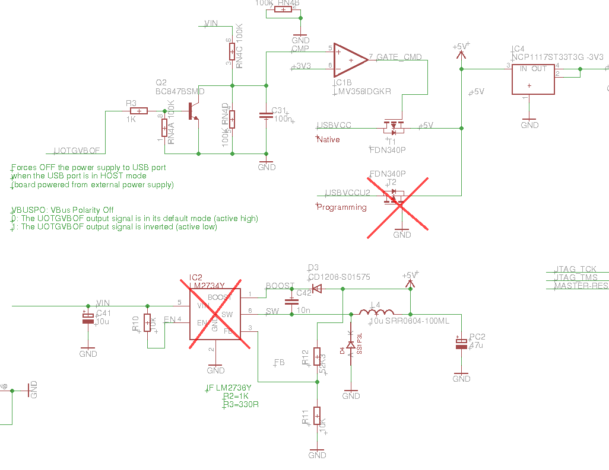
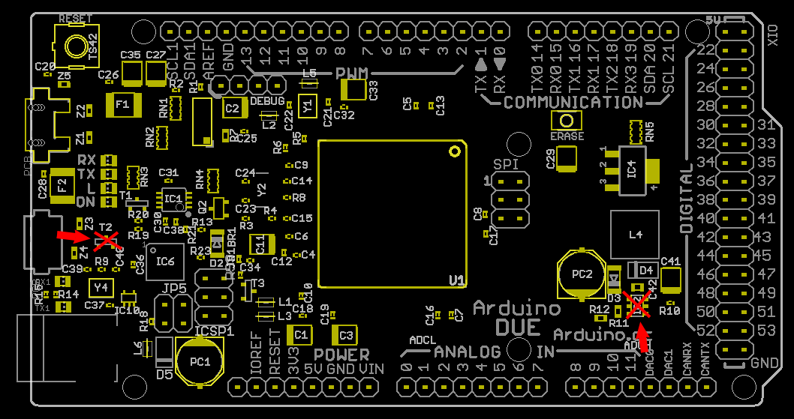

The EEZ PSU Arduino shield is used for powering inserted Arduino Due board. Please note that if Arduino Due is connected to the PC directly (optional USB isolator on AUX PS is not emplyed) it will stay powered on even when the EEZ PSU is switched off.
If such behavior is not acceptable it can be easily fixed by removing mosfet T2.
Additionaly, the IC2 could be removed since Vin power input is not used.

*If you are using hot-air for desoldering additional care should be taken to not melt down 36-pin 0.1" vertical socket (DiGITAL).*

