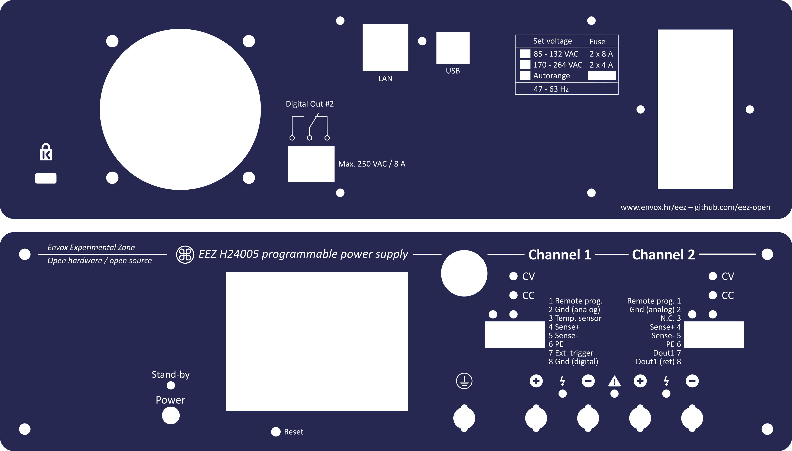

* 3D model generated by [Varisom](http://www.varisom.com)
* Your can use *EEZ PSU H24005 enclosure r5B11 (for 4mm acryl).svg* for laser cut of 4mm thick acryl. The file is prepared for [Formulor](http://www.formulor.de).

**********************

Repository: www.github.com/eez-open
Web site: www.envox.hr/eez

**********************
