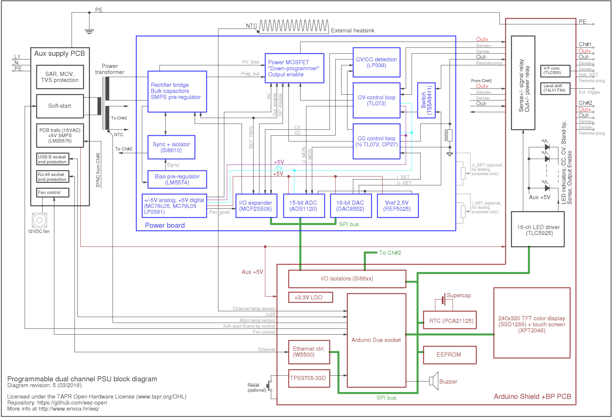

**Preliminary** files for the **Revision 5** includes the following changes:

* Pre-regulator based on LTC3864 with "100% duty cycle" that allows pre-regulator bypassing (MCU controlled for safe operation)
* Pre-regulator and post-regulator merged on to single PCB (*the Power board*)
* Remote programming inputs for both channel using 0-2.5 V analog input for full scale
* Remote digital trigger (Ch1 only)
* Battery NTC monitoring (Ch1 only)
* W5500 Ethernet chip
* Direct connection between power boards and Arduino shield (no power output, remote sense input nor SPI bus cable is required anymore)
* Arduino shield PCB for 2U enclosure (e.g. [Galaxy Maggiorato GX283](http://www.modushop.biz/site/index.php?route=product/product&path=67_194_117&product_id=527), TFT display is now oriented horizontally)
* Arduino Due board support (Mega2560 is not supported anymore)
* Fan control (power + sense)
* Reset circuit with voltage-fail monitoring and "watchdog" functionality

**********************

For more information visit http://www.envox.hr/eez

**********************

