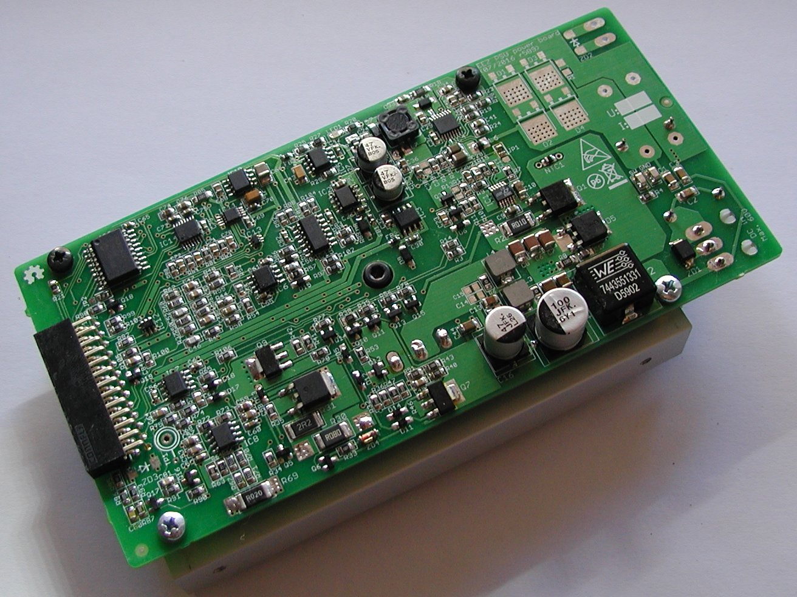

Please refer to the BOM in *Consolidated/BOM* folder where **Board Name** (Col F) is *Arduino shield*. Eagle files is available in *Consolidated/Eagle files* folder.

**Revision history:**
* 2017-02-23: **r5B12**
    - Additional Vin capacitor on Power board ([#19](https://github.com/eez-open/psu-hw/issues/19))
    - Rsense with 4-terminal sensing ([#21](https://github.com/eez-open/psu-hw/issues/21))
    - Protection improvement for DC power input ([#25](https://github.com/eez-open/psu-hw/issues/25))
    - PCB is now 15 mm longer (but still compatible with previous heatsink/mounting holes)
* 2016-12-11: **r5B11**
	- Current limiter is removed
* 2016-10-24: **r5B10**
	- Added optional components on the AC power input
	- Voltage programming switch (IC13) wiring is fixed ([#2](https://github.com/eez-open/psu-hw/issues/2))
	- Mainheatsink (Q4) earth connection is removed ([#3](https://github.com/eez-open/psu-hw/issues/3))
	- Error amps ground reference offset ([#11](https://github.com/eez-open/psu-hw/issues/11))
* 2016-07-23: **r5B9** ([Version 2.0](https://github.com/eez-open/psu-hw/releases/tag/2.0) on github)
	- DAC Vdd input moved from digital +5 V to analog +5 V power supply
	- Changed power input connector type (X1)
	- Optimized number of parts size and values, renumbered reference designators
* 2016-06-16: **r5B8** - first public release (successor of pre- and post-regulator boards available in [Version 1.0](https://github.com/eez-open/psu-hw/releases/tag/1.0) on GitHub)
	- SMPS pre-regulator based on LTC3864
	- 100% duty-cycle mode of operation for lower output ripple
	- Choice between AC and DC power input
	- Remote output voltage programming
	- Remote sense reverse polarity protection
	- Switching frequency synchronization with other channel via Arduino Shield board (no additional cable is required)
	- On-board SMT temperature sensor (no additional cable is required)

This product is made available under the terms of the TAPR Open Hardware License. See the LICENSE.TXT file that accompanies this distribution for the full text of the license.

**********************

Repository: www.github.com/eez-open/psu_hw
Web site: www.envox.hr/eez

**********************

*OSH Park 2-layer.cam* job script is used for generating Gerber files. Use gerbv, a free/open source Gerber viewer (http://gerbv.geda-project.org/)
