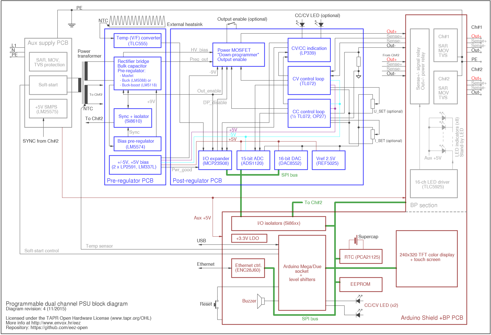

This is repository for the hardware part of the DIY fully programmable dual channel bench power supply. The power supply is designed with taking into consideration the following features and requirements:

- Modular design that allows combining modules with various performance and capability and creation of multiple output solution (min. two channels)
- Voltage regulation (CV), 10 mV resolution
- Current regulation (CC), 10 mA initial resolution (possibly increased to 1 mA)
    Various voltage single range operation (i.e. 0-30 V, 0-40 V or 0-50 V per channel)
- Various current single range operation (i.e. 0-3 A, 0-4 A or 0-5 A per channel)
- Minimal overshoot when new voltage or current level is programmed or in marginal cases such as power on/off
- Min. 15-bit data acquisition resolution
- Various protection mechanisms: over-voltage (OVP), over-current (OCP), over-power (OPP) and over-temperature (OTP)
- Pre-regulator circuit for lower power dissipation (using e.g. phase-control or SMPS)
- Switching frequency synchronization if multiple SMPS are utilized
- Output enable (OE) circuit
- Remote voltage sense
- Simple AC input protection (surge and transient protection)
- Simple DC output protection (reverse voltage, over-voltage)
- Serial and parallel connection of the multiple channels
- MCU based digital control module using Arduino/Genuino boards such as [Mega](https://www.arduino.cc/en/Main/ArduinoBoardMega2560)  or [Due](https://www.arduino.cc/en/Main/ArduinoBoardDue) 
- SPI bus for communication with peripherals
- Galvanic isolation between digital module and power channels
- Real-time clock (RTC) with supercap/batter backup
- EEPROM used as a configuration and calibration parameters storage
- SD-card as an additional storage
- USB support that can be used for remote control, as a debug console and firmware upload
- Ethernet support for remote control
- Local control using TFT touch-screen display
- Fan-less (“quiet”) operation
- Basic functionality for e.g. initial testing during assembling phase does not require digital control. It’s achievable by using standard potentiometers and mechanical switches
- Usage of easy to find components that could be obtain with just single order from suppliers such as Farnell element14 or Transfer Multisort Elektronik (TMU.eu)
- Possibility to house at least dual channel version in affordable metallic enclosure (e.g. Hi-fi 2000/Modushop.biz Economica EP1153220 L 320 x P 200)
- Comprehensive software support that include [SCPI](http://www.envox.hr/eez/bench-power-supply/psu-scpi-reference-manual/psu-scpi-introduction.html)  remote control, GUI configuration and monitoring and even multi-platform (Windows, Linux, OS X) software simulator of the firmware functionality 

**********************

For more information visit http://www.envox.hr/eez/bench-power-supply/psu-introduction.html

**********************

