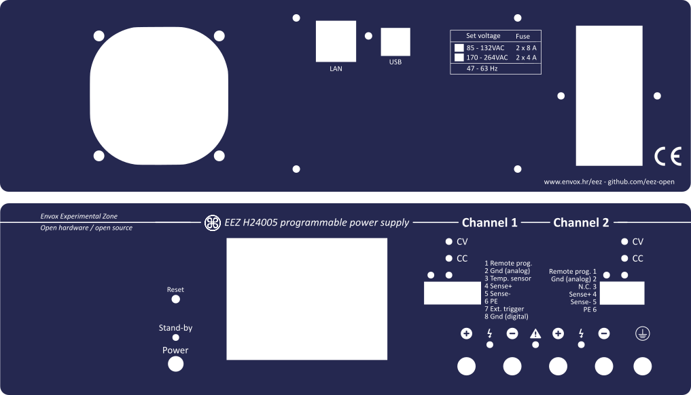
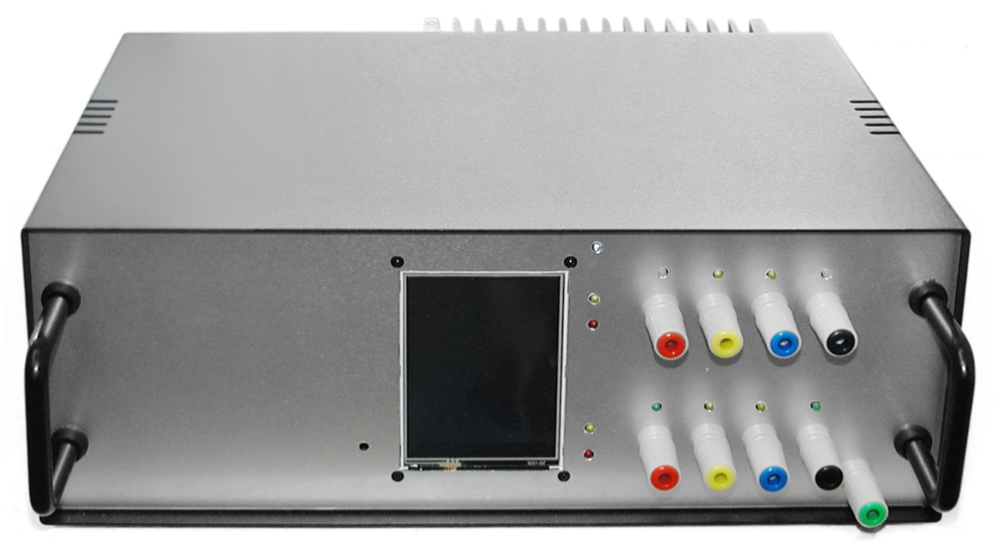
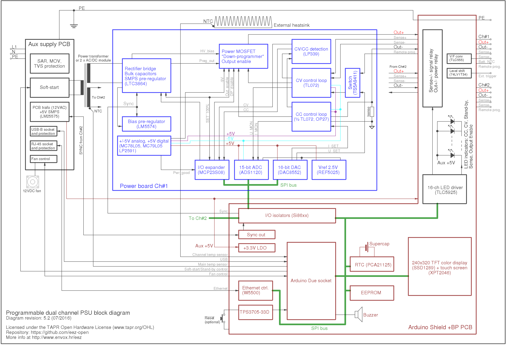

*
Rear and front panels for the new enclosure
*

*
Second working prototype without front mask (2 x 40 V, 5 A)
*

This is repository for the hardware part of the DIY fully programmable dual channel bench power supply. The power supply is designed with taking into consideration the following features and requirements:

- Modular design that allows combining modules with various performance and capability and creation of multiple output solution (min. two channels)
- Voltage regulation (CV), 10 mV resolution
- Current regulation (CC), 10 mA initial resolution (possibly increased to 1 mA)
    Various voltage single range operation (0-40 V default, 0-30 V or 0-50 V per channel)
- Various current single range operation (0-5 A default, 0-3 A or 0-4 A per channel)
- Minimal overshoot when new voltage or current level is programmed or in marginal cases such as power on/off
- 15-bit data acquisition resolution
- Various protection mechanisms: over-voltage (OVP), over-current (OCP), over-power (OPP) and over-temperature (OTP), current limiting when temperature sensors or cooling fan fault is detected
- SMPS pre-regulator circuit for lower power dissipation (using e.g. SMPS)
- SMPS pre-regulator's "100% Duty cycle" mode of operation to lower output ripple and noise 
- Switching frequency synchronization if multiple SMPS are utilized
- Output enable (OE) circuit
- Remote voltage sense
- Remote voltage programming
- External digital trigger (3.3 or 5 V logic level)
- Simple AC input protection (surge and transient protection)
- Selectable 115/230 VAC, Soft-start/Stand-by mode
- Simple DC output protection (reverse voltage, over-voltage)
- Serial and parallel connection of the multiple channels
- MCU based digital control module using 32-bit Arduino/Genuino boards such as [Due](https://www.arduino.cc/en/Main/ArduinoBoardDue)
- SPI bus for communication with peripherals
- Galvanic isolation between digital module and power channels
- Real-time clock (RTC) with supercap/batter backup
- EEPROM used as a configuration and calibration parameters storage
- SD-card as an additional storage
- USB support that can be used for remote control, as a debug console and firmware upload
- Ethernet support for remote control
- Local control using TFT touch-screen display
- Usage of easy to find components that could be obtain with just single order from suppliers such as Farnell element14 or Transfer Multisort Elektronik (TMU.eu)
- Possibility to house at least dual channel version in affordable and compact (2U height) metallic enclosure
- Comprehensive software support that include [SCPI](http://www.envox.hr/eez/bench-power-supply/psu-scpi-reference-manual/psu-scpi-introduction.html)  remote control, GUI configuration and monitoring and even multi-platform (Windows, Linux, OS X) software simulator of the firmware functionality

**********************

For more information visit http://www.envox.hr/eez/bench-power-supply/psu-introduction.html

**********************

